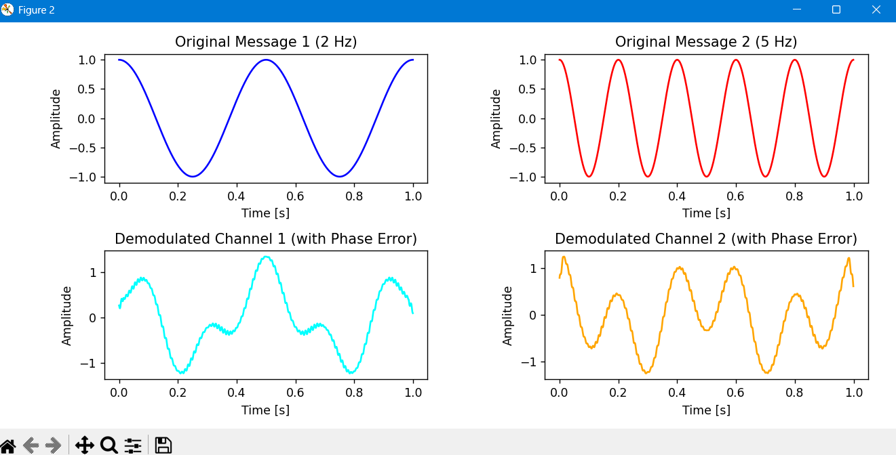
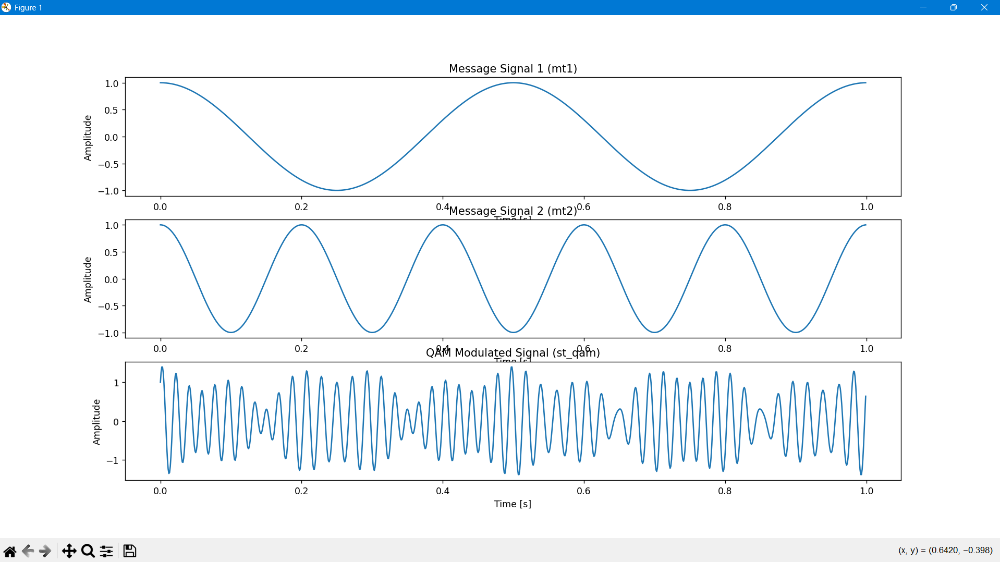
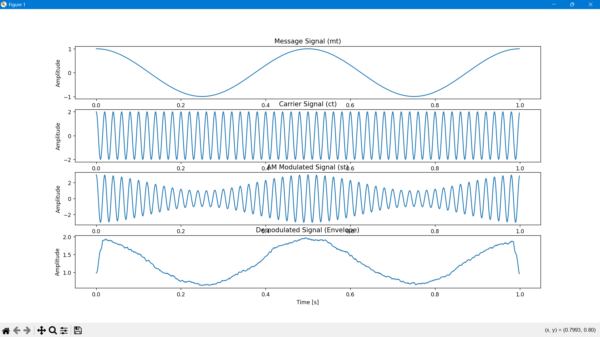

# QAM-Modulation
# Quadrature Amplitude Modulation (QAM) with Phase Error Analysis

[cite_start]A Python-based simulation demonstrating **Quadrature Amplitude Modulation (QAM)** and evaluating the critical impact of a **Phase Error ($\alpha$)** during the synchronous demodulation process. This project provides a practical insight into signal multiplexing, orthogonal carrier principles, and physical layer impairments in modern digital communication systems.

## Project Overview

[cite_start]Quadrature Amplitude Modulation allows two independent message signals to be transmitted simultaneously over the same frequency band by utilizing two orthogonal carriers (Cosine and Sine). However, coherent demodulation requires perfect phase synchronization. This simulation models:
1. [cite_start]**QAM Modulation:** Multiplexing two distinct low-frequency cosine messages ($m_1(t)$ at 2 Hz and $m_2(t)$ at 5 Hz) onto a 50 Hz carrier.
2. [cite_start]**Phase Error Simulation:** Introducing a $30^\circ$ phase offset ($\alpha = 30^\circ$) in the receiver's local oscillator to simulate synchronization degradation.
3. [cite_start]**QAM Demodulation & Cross-Talk Analysis:** Demodulating the signal and applying a moving average Low-Pass Filter (LPF) to visualize how phase errors cause severe cross-talk (inter-channel interference) between the two signals.

## Mathematical Background

In an ideal system, the orthogonal carriers allow perfect separation. When a phase error $\alpha$ is introduced in the local oscillator:
- **In-phase Component ($y_1(t)$):** Receives $m_1(t)\cos(\alpha) - m_2(t)\sin(\alpha)$, showcasing the leakage from the quadrature channel.
- **Quadrature Component ($y_2(t)$):** Receives $m_2(t)\cos(\alpha) + m_1(t)\sin(\alpha)$, showcasing the leakage from the in-phase channel.

[cite_start]This simulation visually captures this cross-talk phenomenon.

## Core Features & Concepts Implemented
- [cite_start]**Orthogonal Multiplexing:** Simulating simultaneous in-phase ($I$) and quadrature ($Q$) channel transmissions.
- [cite_start]**Impairment Modeling:** Quantifying the analytical degradation caused by a constant phase offset.
- [cite_start]**DSP Filtering:** Implementing a moving average window configuration for low-pass filtering via discrete convolution (`np.convolve`).
- [cite_start]**Comparative Visualization:** Side-by-side time-domain comparison of the original signals versus the corrupted demodulated channels.

